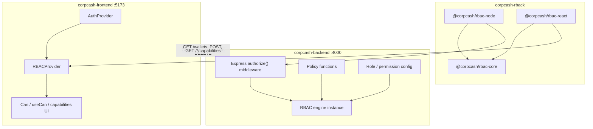
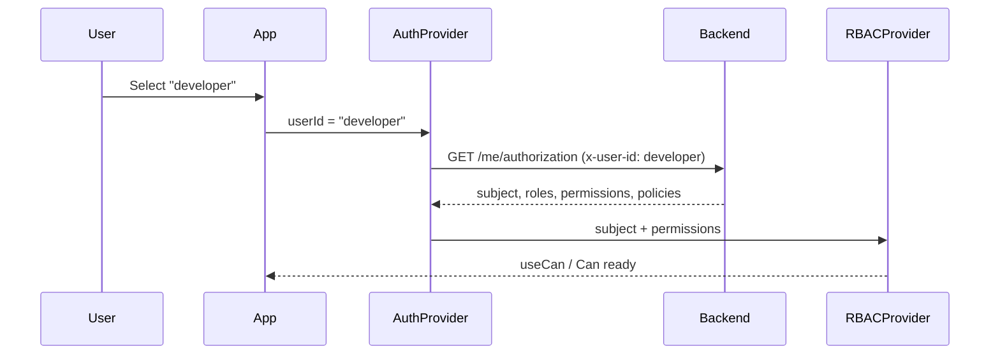

# Corpcash RBAC — Backend & Frontend Integration Guide

This document describes how the **Corpcash demo stack** integrates the `@corpcash/rbac-*` library across backend and frontend, how all six authorization concepts are applied, and how to adapt this pattern for production.

## Repository layout

```
feature-poc/
├── corpcash-rback/          # RBAC library (npm packages)
│   └── packages/
│       ├── core/            # @corpcash/rbac-core   — authorization engine
│       ├── node/            # @corpcash/rbac-node   — Express / NestJS adapters
│       └── react/           # @corpcash/rbac-react  — React hooks & components
├── corpcash-backend/        # Express API (authoritative security)
└── corpcash-frontend/       # React UI (UX-only authorization)
```

Packages are linked locally via `file:` dependencies — no npm publish required for development.

---

## 1. Architecture overview



### Golden rules

1. **One authorization model** — `subject + action + resource (+ context) → allow/deny`
2. **Backend is the security boundary** — every mutating API route runs `authorize()`
3. **Frontend never receives policy source code** — only effective permissions and capability results
4. **Roles/permissions are defined once** on the backend — frontend consumes computed output
5. **Default deny** — missing permission or failed policy = 403

---

## 2. The six RBAC concepts

| Concept | Question | Backend location | Frontend usage |
|---------|----------|------------------|----------------|
| **Subject** | Who is requesting? | `src/users.ts` → `resolveUser()` | From `GET /me/authorization` → `RBACProvider` |
| **Role** | What access profile? | `src/rbac/config.ts` | Displayed in concepts panel; drives permissions |
| **Permission** | What is allowed in general? | `resource:action` in role config | `permissions[]` → `useCan` / `<Can>` |
| **Action** | What operation? | Route handlers (`read`, `approve`, `deploy`) | Buttons, API calls |
| **Resource** | On what object? | Type `"wallet"` or instance `{ type, id, ownerId }` | Capabilities API + debugger |
| **Policy** | Extra conditions? | `src/rbac/policies.ts` | **Not in browser** — use `/capabilities` |

### Evaluation order (backend)

```
1. Resolve Subject (from auth)
2. Resolve Roles → Permissions (with inheritance)
3. Match permission (supports wildcards: wallet:*, *:read, *:*)
4. Evaluate Policy (if registered for that permission)
5. Default DENY
```

---

## 3. Library packages

### `@corpcash/rbac-core`

Framework-agnostic engine. Used directly on the backend; indirectly on the frontend via `@corpcash/rbac-react`.

```typescript
import { RBAC } from "@corpcash/rbac-core";

const rbac = new RBAC({ roles: { admin: { permissions: ["*:*"] } } });

rbac.registerPolicyFor("wallet", "delete", ({ subject, resource }) => {
  return typeof resource === "object" && subject.id === resource.ownerId;
});

rbac.authorize({
  subject: { id: "dev-1", roles: ["developer"] },
  action: "delete",
  resource: { type: "wallet", id: "wallet_1", ownerId: "dev-1" },
});
// → { allowed: true, reason: "AUTHORIZED", matchedPermission: "..." }
```

### `@corpcash/rbac-node`

Express middleware and NestJS guards. The backend uses:

```typescript
import { createRBAC } from "@corpcash/rbac-node";
import { createExpressMiddleware } from "@corpcash/rbac-node/express";

const rbac = createRBAC(rbacConfig);
const { authorize } = createExpressMiddleware({
  rbac,
  getSubject: (req) => resolveUser(req.headers["x-user-id"]),
});

app.get("/wallets", authorize("wallet", "read"), handler);
app.delete("/wallets/:id", authorize({
  resource: "wallet",
  action: "delete",
  getResource: (req) => ({ type: "wallet", id, ownerId }),
}), handler);
```

Returns **401** when no subject, **403** when denied.

### `@corpcash/rbac-react`

Client adapter over the same permission model:

```tsx
<RBACProvider subject={subject} permissions={permissions}>
  <Can resource="wallet" action="create">
    <CreateButton />
  </Can>
</RBACProvider>
```

Uses **permission-only mode** — receives expanded `permissions[]`, not full role config or policies.

---

## 4. Backend integration (corpcash-backend)

### 4.1 Project structure

```
corpcash-backend/src/
├── index.ts                 # Express app, routes, capabilities builder
├── users.ts                 # SUBJECT definitions + resolveUser()
├── rbac/
│   ├── config.ts            # ROLE + PERMISSION config + UI metadata
│   └── policies.ts          # POLICY functions + createAppRbac()
└── store/
    ├── wallets.ts           # RESOURCE data (wallet instances)
    └── transactions.ts      # RESOURCE data (transaction instances)
```

### 4.2 Linking the library

```json
{
  "dependencies": {
    "@corpcash/rbac-core": "file:../corpcash-rback/packages/core",
    "@corpcash/rbac-node": "file:../corpcash-rback/packages/node"
  }
}
```

Rebuild library after changes:

```bash
cd ../corpcash-rback
pnpm build --filter @corpcash/rbac-core --filter @corpcash/rbac-node
```

### 4.3 Subject (authentication → authorization)

**Demo:** `x-user-id` header maps to a predefined subject.

**Production:** Replace `resolveUser()` with JWT/session lookup:

```typescript
function resolveUser(req: Request): Subject | null {
  const claims = verifyJwt(req.headers.authorization);
  if (!claims) return null;
  return {
    id: claims.sub,
    roles: claims.roles,           // from identity provider or DB
    attributes: {
      organizationId: claims.orgId,
      department: claims.dept,
    },
  };
}
```

Demo subjects (`src/users.ts`):

| Header value | Subject ID | Roles | Org |
|--------------|------------|-------|-----|
| `viewer` | viewer-1 | viewer | org_1 |
| `developer` | dev-1 | developer | org_1 |
| `admin` | admin-1 | admin | org_1 |

### 4.4 Roles & permissions

Defined in `src/rbac/config.ts`:

```typescript
roles: {
  viewer: {
    permissions: ["wallet:read", "transaction:read"],
  },
  developer: {
    inherits: ["viewer"],
    permissions: [
      "wallet:create", "wallet:update", "wallet:delete",
      "transaction:approve", "contract:read", "contract:deploy",
    ],
  },
  admin: {
    permissions: ["*:*"],
  },
}
```

`rbac.getEffectivePermissions(subject)` expands inheritance into a flat list for the frontend.

### 4.5 Policies

Registered in `src/rbac/policies.ts`:

**Policy 1 — `wallet:delete` (ownership)**

```typescript
subject.id === resource.ownerId
```

**Policy 2 — `transaction:approve` (org + amount)**

```typescript
subject.attributes.organizationId === resource.organizationId
&& (amount <= 100_000 || subject.roles.includes("admin"))
```

Policies run **after** permission match. A user with `wallet:delete` who is not the owner gets `POLICY_DENIED`.

### 4.6 API reference

#### `GET /me/authorization`

Primary contract for frontend bootstrap.

**Request:** `x-user-id: developer`

**Response:**

```json
{
  "subject": {
    "id": "dev-1",
    "roles": ["developer"],
    "attributes": { "organizationId": "org_1", "department": "engineering" }
  },
  "roles": ["developer"],
  "permissions": ["wallet:create", "wallet:update", "wallet:delete", "..."],
  "roleDefinitions": { "viewer": { "description": "...", "permissions": [...] } },
  "policies": [
    { "permission": "wallet:delete", "description": "...", "evaluatedOn": "backend" }
  ],
  "concepts": { "subject": "...", "role": "...", ... }
}
```

#### `POST /rbac/authorize`

Debug endpoint — runs full authorization and returns the decision.

**Body:**

```json
{
  "action": "delete",
  "resource": { "type": "wallet", "id": "wallet_1", "ownerId": "dev-1" }
}
```

**Response:**

```json
{
  "request": { "subject": {...}, "action": "delete", "resource": {...} },
  "result": {
    "allowed": true,
    "reason": "AUTHORIZED",
    "matchedPermission": "wallet:delete"
  }
}
```

#### Resource routes

| Method | Path | Permission | Policy |
|--------|------|------------|--------|
| GET | `/wallets` | wallet:read | — |
| POST | `/wallets` | wallet:create | — |
| DELETE | `/wallets/:id` | wallet:delete | ownership |
| GET | `/wallets/:id/capabilities` | — | computes read/update/delete |
| GET | `/transactions` | transaction:read | — |
| POST | `/transactions/:id/approve` | transaction:approve | org + amount |
| GET | `/transactions/:id/capabilities` | — | computes read/approve |
| POST | `/contracts/deploy` | contract:deploy | — |

#### Capabilities response

`GET /wallets/wallet_1/capabilities` (as developer who owns wallet_1):

```json
{
  "resource": { "type": "wallet", "id": "wallet_1", "ownerId": "dev-1" },
  "capabilities": {
    "read":   { "allowed": true,  "reason": "AUTHORIZED", "matchedPermission": "wallet:read" },
    "update": { "allowed": true,  "reason": "AUTHORIZED", "matchedPermission": "wallet:update" },
    "delete": { "allowed": true,  "reason": "AUTHORIZED", "matchedPermission": "wallet:delete" }
  }
}
```

Same developer on `wallet_2` (owner: admin-1):

```json
"delete": { "allowed": false, "reason": "POLICY_DENIED", "matchedPermission": "wallet:delete" }
```

---

## 5. Frontend integration (corpcash-frontend)

### 5.1 Project structure

```
corpcash-frontend/src/
├── api/client.js              # HTTP client → backend API
├── context/AuthContext.jsx    # Loads /me/authorization
├── components/
│   ├── UserSwitcher.jsx       # Demo user selection
│   ├── RbacConceptsPanel.jsx  # All 6 concepts (live data)
│   ├── WalletDashboard.jsx    # Wallets + RBACProvider wrapper
│   ├── TransactionPanel.jsx   # Transaction approve + policy UI
│   └── ActionsDemo.jsx        # contract:deploy + authorize debugger
├── utils/rbac.js              # Permission helpers
└── App.jsx                    # Root layout
```

### 5.2 Linking the library

```json
{
  "dependencies": {
    "@corpcash/rbac-react": "file:../corpcash-rback/packages/react"
  }
}
```

Rebuild:

```bash
cd ../corpcash-rback && pnpm build --filter @corpcash/rbac-react
```

### 5.3 API proxy (development)

Vite proxies `/api/*` → `http://localhost:4000/*`:

```javascript
// vite.config.js
proxy: {
  '/api': {
    target: 'http://localhost:4000',
    rewrite: (path) => path.replace(/^\/api/, ''),
  },
}
```

Frontend calls `/api/me/authorization` → backend `GET /me/authorization`.

Override with `VITE_API_URL=http://localhost:4000` for direct calls (requires CORS — already enabled on backend).

### 5.4 Authentication & authorization bootstrap



**AuthProvider** (`src/context/AuthContext.jsx`):

- Calls `fetchAuthorization(userId)` on mount / user change
- Stores `subject`, `permissions`, `roleDefinitions`, `policies`
- Does **not** store or execute policy functions

**RBACProvider** (inside `WalletDashboard`):

```jsx
<RBACProvider subject={auth.subject} permissions={auth.permissions}>
  {children}
</RBACProvider>
```

### 5.5 Two types of frontend authorization

#### Type A — Generic UI (permission-only)

Use when the check is **not** tied to a specific resource instance.

```jsx
// Show create button if role grants wallet:create
<Can resource="wallet" action="create">
  <button>Create Wallet</button>
</Can>

const canDeploy = useCan('contract', 'deploy')
```

Data source: `permissions[]` from `/me/authorization`.

#### Type B — Instance-level UI (policy-aware)

Use when business rules depend on **this specific record** (ownership, org, amount).

```jsx
// Fetch backend-computed capabilities (includes policies)
const caps = await fetchWalletCapabilities(userId, wallet.id)
const canDelete = caps.capabilities.delete.allowed
```

**Do not** duplicate policy logic in React. The backend `/capabilities` endpoint runs the same `rbac.authorize()` as the API route.

### 5.6 UI sections mapped to concepts

| UI section | Concepts demonstrated |
|------------|----------------------|
| **RBAC Concepts panel** | All 6 — live data from backend |
| **Wallets table** | Resource instances + capabilities (permission + policy) |
| **Transactions table** | Action `approve` + org/amount policies |
| **Actions demo** | Custom action `deploy` + `POST /rbac/authorize` debugger |

---

## 6. End-to-end flows

### Flow A — List wallets (permission only)

```
Frontend                          Backend
   │                                 │
   │  GET /wallets                   │
   │  x-user-id: viewer              │
   │ ───────────────────────────────►│
   │                                 │ resolveUser → Subject
   │                                 │ authorize(wallet, read) → ALLOW
   │◄─────────────────────────────── │
   │  200 [ wallets... ]             │
```

Viewer: allowed. User without `wallet:read`: 403.

### Flow B — Delete wallet (permission + policy)

```
Frontend                          Backend
   │                                 │
   │  DELETE /wallets/wallet_1       │
   │  x-user-id: developer           │
   │ ───────────────────────────────►│
   │                                 │ Permission: wallet:delete ✓ (developer)
   │                                 │ Policy: ownerId === dev-1 ✓
   │◄─────────────────────────────── │
   │  200 { deleted: wallet_1 }      │
```

Developer deleting admin's wallet:

```
Permission: wallet:delete ✓
Policy: ownerId !== dev-1 ✗
→ 403 POLICY_DENIED
```

### Flow C — Approve transaction (policy with attributes)

| Transaction | Amount | Org | Developer | Admin |
|-------------|--------|-----|-----------|-------|
| tx_1 | ₹50,000 | org_1 | ALLOW | ALLOW |
| tx_2 | ₹5,00,000 | org_1 | DENY (amount) | ALLOW |
| tx_3 | ₹10,000 | org_2 | DENY (org) | DENY (org) |

Frontend shows policy reason from `/transactions/:id/capabilities` before enabling the Approve button.

### Flow D — Frontend delete button visibility

```
1. RBACProvider checks permission: wallet:delete → show delete column logic
2. Per row: GET /wallets/:id/capabilities → capabilities.delete.allowed
3. User clicks Delete → DELETE /wallets/:id → backend re-authorizes (never trust UI)
```

Even if a user manipulates the DOM to show a button, the API returns 403.

---

## 7. Production migration checklist

### Authentication

| Demo | Production |
|------|------------|
| `x-user-id` header | JWT in `Authorization: Bearer ...` |
| Static `demoUsers` map | User service / identity provider |
| Header forwarded by frontend | Token from secure storage / httpOnly cookie |

### Authorization config

| Concern | Recommendation |
|---------|----------------|
| Role definitions | Single file or DB — backend only |
| Policy functions | Backend code only — never expose to client |
| Frontend permissions | `GET /me/authorization` after login |
| Instance UI | `GET /resource/:id/capabilities` pattern |
| Caching | Short TTL on permissions; invalidate on role change |

### Security

- Treat all frontend checks as **UX hints**
- Log `AuthorizationResult.reason` on denials for audit
- Use HTTPS in production
- Restrict CORS to your frontend origin (replace `*`)

### Publishing the library

When ready to move off `file:` dependencies:

```json
"@corpcash/rbac-core": "^0.1.0",
"@corpcash/rbac-node": "^0.1.0",
"@corpcash/rbac-react": "^0.1.0"
```

---

## 8. Local development

### Terminal 1 — Build library (after changes)

```bash
cd corpcash-rback
pnpm install
pnpm build --filter @corpcash/rbac-core --filter @corpcash/rbac-node --filter @corpcash/rbac-react
```

### Terminal 2 — Backend

```bash
cd corpcash-backend
npm install
npm run dev    # http://localhost:4000
```

### Terminal 3 — Frontend

```bash
cd corpcash-frontend
npm install
npm run dev    # http://localhost:5173
```

### Smoke tests

```bash
# Authorization payload
curl -s -H "x-user-id: developer" http://localhost:4000/me/authorization | jq .

# Policy-aware capabilities
curl -s -H "x-user-id: developer" http://localhost:4000/wallets/wallet_2/capabilities | jq .

# Transaction policy (high amount → denied for developer)
curl -s -H "x-user-id: developer" http://localhost:4000/transactions/tx_2/capabilities | jq .
```

---

## 9. Troubleshooting

| Symptom | Cause | Fix |
|---------|-------|-----|
| Frontend "Authorization unavailable" | Backend not running | Start `corpcash-backend` on port 4000 |
| Old API response shape | Stale backend process | Kill port 4000, restart backend |
| `Cannot GET /capabilities` | Old backend without new routes | Pull latest, restart |
| Permission changes not reflected | Library not rebuilt | `pnpm build` in corpcash-rback |
| CORS errors | Bypassing Vite proxy | Use `/api/...` paths or set CORS origin |
| Delete button wrong | Using permission-only check | Use `/capabilities` for instance actions |

---

## 10. Quick reference — who owns what

| Data / logic | Owner |
|--------------|-------|
| Role definitions | Backend `rbac/config.ts` |
| Policy functions | Backend `rbac/policies.ts` |
| Subject identity | Auth system → backend `resolveUser()` |
| Resource records | Application DB / store |
| Effective permissions | Backend computes → sent to frontend |
| Generic UI visibility | Frontend `useCan` / `<Can>` |
| Instance UI visibility | Backend `/capabilities` |
| Security enforcement | Backend `authorize()` on every route |

---

## 11. Related documentation

- Library overview: [`corpcash-rback/README.md`](../corpcash-rback/README.md)
- Core API: [`corpcash-rback/packages/core/README.md`](../corpcash-rback/packages/core/README.md)
- Node adapters: [`corpcash-rback/packages/node/README.md`](../corpcash-rback/packages/node/README.md)
- React adapters: [`corpcash-rback/packages/react/README.md`](../corpcash-rback/packages/react/README.md)
- Backend README: [`corpcash-backend/README.md`](../corpcash-backend/README.md)
- Frontend README: [`corpcash-frontend/README.md`](../corpcash-frontend/README.md)
